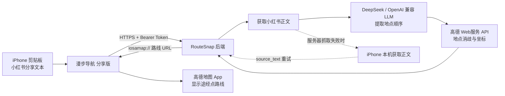

# 漫步导航 · RouteSnap 分享版

把小红书分享文本复制到 iPhone 剪贴板，运行“漫步导航 分享版”，自动提取路线地点并打开高德地图，带入起点、终点和途经点。

这是一个完全自托管的版本：每位使用者使用自己的服务器、LLM API Key 和高德 Web服务 API Key，不依赖原作者的腾讯云或任何公开中转服务。

## 工作流程



## 你需要准备

- 一台 Linux 云服务器，推荐 Ubuntu 22.04/24.04
- 一个解析到服务器公网 IP 的域名
- [DeepSeek API Key](https://platform.deepseek.com/api_keys)，或其他 OpenAI Chat Completions 兼容服务
- [高德开放平台](https://console.amap.com/dev/key/app)的“Web服务 API”类型 Key
- 安装了高德地图的 iPhone
- Docker Compose（推荐部署方式），或 Python 3.11+、systemd 和 Caddy

## 最快部署：Docker Compose

```bash
git clone YOUR_GITHUB_REPOSITORY_URL
cd routesnap
cp .env.example .env
openssl rand -hex 32
```

编辑 `.env`，至少替换以下内容：

```env
DEEPSEEK_API_KEY=你的LLM密钥
DEEPSEEK_API_URL=https://api.deepseek.com/chat/completions
DEEPSEEK_MODEL=deepseek-v4-flash
AMAP_KEY=你的高德Web服务Key
ROUTESNAP_ACCESS_TOKEN=刚才生成的64位随机字符串
ROUTESNAP_DOMAIN=api.example.com
ROUTESNAP_DATA_DIR=/data
```

确认域名已经解析到服务器，并在云防火墙放行 TCP 80、443 后运行：

```bash
./scripts/check-config.sh .env
docker compose up -d --build
curl https://api.example.com/health
```

`/health` 返回 `"configured": true` 后，安装 [shortcut/RouteSnap-Share.shortcut](shortcut/RouteSnap-Share.shortcut)。文件内部显示名称仍是“漫步导航 分享版”。导入时把主请求和重试请求都填写为同一个地址与令牌：

- 完整地址：`https://api.example.com/parse`
- Authorization：`Bearer 你的ROUTESNAP_ACCESS_TOKEN`

详细步骤见[五分钟部署](docs/QUICKSTART.md)。

## 部署方式

- [五分钟 Docker Compose 部署](docs/QUICKSTART.md)（推荐）
- [Ubuntu + systemd + Caddy 部署](docs/SERVER_SETUP.md)
- [申请和配置 DeepSeek、高德 Key](docs/API_KEYS.md)
- [安装与配置 iPhone 快捷指令](docs/SHORTCUT_SETUP.md)
- [故障排查](docs/TROUBLESHOOTING.md)
- [架构与数据流](docs/ARCHITECTURE.md)
- [发布到 GitHub 前的检查](docs/PUBLISHING.md)
- [安全说明](SECURITY.md)

## 常用运维命令

Docker：

```bash
docker compose ps
docker compose logs -f api
docker compose pull
docker compose up -d --build
```

systemd：

```bash
sudo systemctl status routesnap-share
sudo journalctl -u routesnap-share -f
sudo systemctl restart routesnap-share
```

线上完整检查：

```bash
./scripts/smoke-test.sh https://api.example.com YOUR_ACCESS_TOKEN
```

## 本地开发

```bash
python3 -m venv .venv
source .venv/bin/activate
pip install -r requirements.txt
python -m unittest -v test_mobile_amap_only.py
```

单元测试不会调用真实 DeepSeek、高德或小红书接口。GitHub Actions 会在 Python 3.11 和 3.12 上运行发布包检查。

## 重要限制

- 主要使用场景是 iPhone 调起高德地图，不提供 Mac Web 路线页。
- 小红书可能调整分享页或风控策略；服务器两种浏览器标识都失败时，快捷指令才尝试用手机网络获取正文。
- 项目保留“相邻距离超过 5 公里的地点静默删除”规则。
- 高德原生 URL 的途经点能力受高德 App 版本和平台行为影响。

## 隐私

LLM Key 和高德 Key 只保存在你的服务器 `.env` 中。快捷指令只保存你的后端地址和 `ROUTESNAP_ACCESS_TOKEN`。服务器会接收你主动提交的小红书分享文本或手机取得的页面正文，详细说明见 [SECURITY.md](SECURITY.md)。
